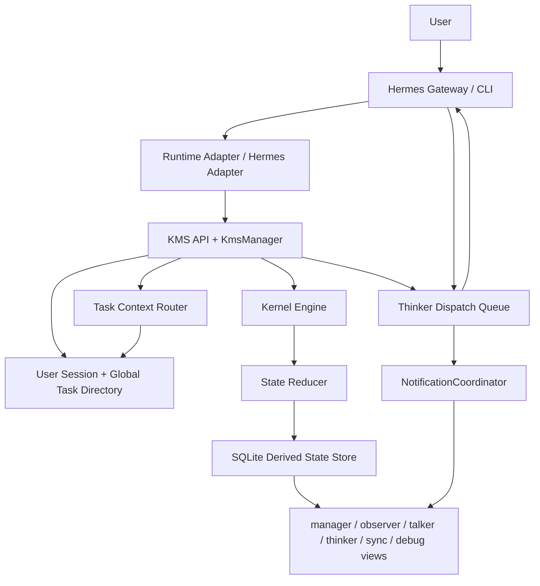

# 当前 Agent 架构说明

日期：2026-06-22

## 1. 总体定位

当前项目不是要替代 Hermes，也不是要重新实现完整 Agent Runtime。

当前架构定位是：

```text
Hermes / Host Runtime
  负责：消息历史、模型执行、工具调用、流式输出、runtime session

KMS
  负责：用户消息调度、任务路由、是否打断、是否直接回答、通知和 dispatch

Kernel
  负责：认知状态、任务状态、事件归约、可见性视图、审计
```

一句话：

```text
Hermes 负责“跑任务”，KMS 负责“调度任务”，Kernel 负责“保存和解释任务状态”。
```

## 2. 当前分层



## 3. 核心模块

| 模块 | 当前职责 |
|---|---|
| Hermes Gateway / CLI | 接收用户消息，执行真实模型和工具 |
| HermesAdapter | Hermes 侧调用 Kernel/KMS 的 HTTP client |
| RuntimeEventAdapter | 通用 runtime adapter，已完成第一版 |
| KMS API | 对外提供 dispatch、thinker lifecycle、notification、view API |
| KmsManager | 用户消息调度主入口，目前仍偏大 |
| TaskRoutingCoordinator | 管理 user session、读取 global tasks、调用 router |
| Task Context Router | 判断用户消息属于哪个 task，或是否需要澄清 |
| DispatchLifecycleCoordinator | 创建 run、激活 run、创建 thinker dispatch |
| InterruptCoordinator | 处理中断当前任务、暂停 task |
| ResumeCoordinator | 恢复 paused task |
| KernelEngine | 连接 store 和 reducer，生成 views |
| State Reducer | 从事件流计算当前状态 |
| NotificationCoordinator | 根据 dispatch complete / fail 生成 observer notification |
| ConversationRefCoordinator | 统一写 task conversation refs |

## 4. 当前数据模型

| 表 / 状态 | 用途 |
|---|---|
| `user_sessions` | 用户会话，一个 user session 可以挂多个 task |
| `global_tasks` | 全局任务目录，用于多任务路由 |
| `task_context_routes` | 每次用户消息的路由审计 |
| `session_links` | kernel session 和 runtime session 的映射 |
| `task_snapshots` | task 当前快照 |
| `task_brief_states` | task-first 意图/任务概要主读模型 |
| `task_flows` | task-first 计划/流程主读模型 |
| `claim_items` | task-first claim 主读模型 |
| `todo_obligations` | task-first todo 主读模型 |
| `intent_states` | 旧架构意图状态，当前只作为历史数据读取 fallback |
| `plan_states` | 旧架构计划状态，当前只作为历史数据读取 fallback |
| `belief_items` | 旧架构 belief 状态，当前只作为历史数据读取 fallback |
| `commitments` | 旧架构 commitment 状态，当前只作为历史数据读取 fallback |
| `thinker_dispatches` | KMS 下发给 Thinker 的任务单 |
| `observer_notifications` | 通知 Observer / Talker 主动刷新或汇报 |
| `task_conversation_refs` | task 级消息摘要和 runtime message 引用，不保存完整 transcript |
| `runtime_refs` | runtime 消息、工具、结果引用索引 |

当前状态源结论：

- `task_brief_states / task_flows / claim_items / todo_obligations` 已经切为主读模型。
- `save_intent / save_plan / save_belief / save_commitment` 只写新版表。
- 旧表写入代码已经移除，不再支持恢复旧表双写。
- `intent_states / plan_states / belief_items / commitments` 暂不删除，只用于历史数据 fallback。
- `legacy_debug` 只保留在 `manager_view` 和 `debug_view`，不再暴露给 `thinker_view`。
- `GET /kms/state-source-audit` 可查看当前主读切换状态。

## 5. 用户消息主流程

```text
1. Hermes 收到用户消息
2. Hermes 调用 /kms/dispatch-user-message
3. KMS observe user_session
4. Task Router 根据 global_tasks + conversation refs 判断目标 task
5. Intent Classifier 判断：
   - 直接由 Kernel 回答
   - 继续当前 task
   - 打断当前 task，创建新 run
   - 恢复 paused task
   - 需要用户澄清
6. 如果需要 Thinker：
   - KMS 创建 run
   - 更新 task/global_task
   - 创建 thinker_dispatch
7. Hermes claim thinker_dispatch
8. Thinker 执行任务并提交事件
9. Thinker complete / fail dispatch
10. KMS 更新 run 状态，生成 notification 和 conversation ref
11. Observer/Talker 读取 observer_view / talker_view
```

## 6. 打断机制

当前打断机制是：

```text
新用户消息进入同一 user session
-> KMS 判断是否会影响当前 active task
-> 如果需要执行新任务，暂停旧 task
-> 标记旧 run stale / interrupted
-> 创建新 run 和 thinker_dispatch
-> Thinker 只能继续写 active run
```

关键点：

- 旧 run 的 stale 写入不会污染当前用户可见状态。
- 旧 task 会进入 paused，可后续恢复。
- `resume_context` 用于恢复暂停任务。
- 当前默认行为仍接近 Codex：新请求优先打断当前执行。

## 7. 多任务模型

当前已经支持：

```text
一个 user_session
  -> 多个 global_task
  -> 每个 task 有 task_id
  -> 每个 task 可以关联 kernel_session / task snapshot / conversation refs
```

当前已经进入 task-first 主存储阶段：

- `task_brief/task_flow/claim/todo` 是当前主读和默认写入模型。
- 旧 `intent/plan/belief/commitment` 表默认不再写入，只作为历史 fallback。
- `task_conversation_refs` 已经按 task 保存消息摘要和 runtime 引用。
- evidence / execution 已带 `task_id`，用于 task-local 查询隔离。

## 8. Conversation Refs 边界

设计文档明确要求 Kernel 不重复实现 message history。

所以当前 `task_conversation_refs` 保存的是：

```text
message_ref_id
text_summary
role
source
task_id
run_id
metadata
```

不保存：

```text
完整聊天 transcript
完整 reasoning
完整工具结果
runtime 私有日志
```

完整消息历史仍属于 Hermes / Host Runtime。

## 9. Views

| View | 使用者 | 当前内容 |
|---|---|---|
| `manager_view` | 管理界面 / 用户管理视角 | task brief、task flow、active task、风险、通知、dispatch、conversation refs |
| `observer_view` | Observer / Talker / 外部 UI | 可转述摘要、安全事实、未确认点、待办、阻塞原因、允许/禁止动作、conversation refs |
| `talker_view` | Chat Talker | 面向聊天表达的安全进度 |
| `thinker_view` | Thinker | task brief、task flow、claims、evidence、executions、dispatch、cancellation token |
| `sync_view` | 外部协作系统 | 最小同步摘要 |
| `debug_view` | 开发和审计 | 事件、派生状态、内部详情 |

## 10. Notification

当前已有：

```text
observer_notifications
NotificationCoordinator
GET /kms/observer/notifications
GET /kms/talker/notifications
ack / resolve
```

当前 NotificationCoordinator 已负责：

- dispatch completed -> `task_done` 或 `progress_update`
- dispatch failed -> `task_failed`
- stale dispatch 不生成 notification
- 根据通知类型套用 urgency / priority / delivery policy

当前已完成第一版：

- notification 去重
- min interval 节流
- priority 策略表
- delivery policy
- SSE 轻量 stream

还未完成：

- 独立后台 push broker
- WebSocket
- 多次失败后自动升级为 `interrupt` 这类复杂 urgency 升级策略

## 11. 当前已稳定验证的能力

这些能力已经完成并通过测试：

| 能力 | 状态 |
|---|---|
| 用户消息 dispatch | 已完成 |
| 打断当前 run | 已完成 |
| stale run 防污染 | 已完成 |
| paused task 恢复 | 已完成 |
| user session + global task directory | 已完成 |
| Task Router | 已完成第一版 |
| LLM Router | 已接入，可开关 |
| thinker_dispatch claim / heartbeat / complete / fail | 已完成 |
| Hermes Gateway/CLI dispatch 生命周期 | 已完成第一版 |
| proxy mode dispatch 生命周期 | 已完成第一版 |
| manager_view / observer_view | 已完成第一版 |
| observer/talker notification API | 已完成第一版 |
| NotificationCoordinator | 已完成第一版 |
| task conversation refs | 已完成第一版 |
| 新状态表主读和写入 | 已完成 |
| 旧状态表写入退场 | 已完成，integration 和真实 smoke 通过 |
| 旧表 fallback 使用审计 | 已完成第一版，含查看脚本，本轮真实链路未命中 |
| Runtime Event Adapter Hermes 工具事件入口 | 已完成第一版 |
| 真实 Hermes kernel dispatch 工具事件 helper | 已完成第一版 |
| 测试分层 fast / core / integration / full | 已完成 |
| 真实 Router smoke | 已通过 |
| 真实 Hermes interrupt smoke | 已通过 |

## 12. 当前工作区状态

当前主线改动已经按阶段提交。具体是否还有本地未提交内容，以 `git status` 为准。

近期已完成并提交的内容：

| 内容 | 状态 |
|---|---|
| 外部 Observer/Talker 最终回复 conversation ref 回传 | 已完成第一版 |
| ConversationRefCoordinator | 已完成第一版 |
| RuntimeEventAdapter 通用封装 | 已完成第一版 |
| Observer / Talker notification SSE | 已完成第一版 |
| Notification policy 去重 / 节流 / 优先级 | 已完成第一版 |
| StateSourceAudit 主从切换审查 | 已完成第一版 |
| legacy_debug 收窄到 manager/debug | 已完成 |
| 旧状态表写入退场 | 已完成 |
| 旧表 fallback 使用审计 | 已完成第一版 |
| KmsManager dispatch decision 小拆分 | 已完成第一版 |
| KmsManager task dispatch planner 小拆分 | 已完成第一版 |
| Runtime Event Adapter Hermes 事件方法 | 已完成第一版 |
| 旧表物理删除 removal-check | 已完成第一版 |
| 测试分层 | 已完成 |
| 移除旧表写入后的 integration / real smoke | 已通过 |

这些仍然是渐进式实现，不代表 Runtime 生态已经全部接完。

## 13. 仍未完成的主要差距

| 差距 | 说明 |
|---|---|
| KmsManager 仍偏大 | 返回对象和 task dispatch planner 已拆出，但 dispatch 主流程还可继续拆 |
| Runtime Event Adapter 深度接入 Hermes | 工具/summary/raw result 方法已有，真实 Hermes 共享 helper 已补，Gateway 主流程还可继续逐步接入 |
| Observer notification WebSocket | SSE 第一版已完成，WebSocket 未做 |
| Notification 高级优先级策略 | 第一版策略表已完成，复杂升级策略未做 |
| 旧表读取 fallback | 仍保留，用于历史 DB 兼容；已有命中审计 |
| 旧表物理删除 | 未做，需要最后评估 |

## 14. 当前完成度与剩余风险

粗略完成度：

| 模块 | 完成度 | 说明 |
|---|---:|---|
| KMS / Kernel / Thinker 分层 | 92% | 职责基本清晰，dispatch decision 和 task dispatch planner 已从 manager 拆出 |
| 打断与恢复 | 90% | integration 和真实 Hermes smoke 通过 |
| Thinker dispatch 生命周期 | 85% | claim / heartbeat / complete / fail 已接通 |
| Task Router 多任务路由 | 75% | 支持常见指代，LLM Router 已接入 |
| Kernel 直接回答状态问题 | 80% | progress / evidence / failures / claims / todos 已支持 |
| User Session 多任务管理 | 80% | user_sessions / global_tasks / conversation refs 已有 |
| Observer / Manager / Notification | 65% | API / SSE / policy 第一版可用 |
| 新状态表迁移 | 90% | 新表主读、写入代码已切到新表 |
| 旧表退场 | 86% | 写入代码已移除，fallback 已审计且有查看脚本，removal-check 已有，物理删除未完成 |
| 测试体系 | 80% | fast / core / integration / full 已分层 |

当前没有发现完成不了的硬阻塞。剩余主要是收尾、加固和产品化。

真正需要谨慎的风险：

- LLM Router 无法保证 100% 不误判，需要保留低置信度澄清和回归样例。
- 旧表读取 fallback 不能贸然删除，虽然本轮真实链路未命中，但真实历史 DB 可能仍有未迁移数据。
- Observer/Talker 产品层还需要根据真实 UI/协议继续打磨。

## 15. 不建议立刻做的事

暂时不建议：

- 删除旧 `intent/plan/belief/commitment` 表；
- 把完整 message history 存进 Kernel；
- 让 Kernel 接管 Hermes 的 runtime session DB；
- 让 Observer 绕过 `observer_view` 直接读 debug/raw state；
- 为了新命名强行大迁移旧数据。

当前更稳的方向是：

```text
继续渐进式换骨：
先补 task-local refs / views / coordinator
再拆 KmsManager
再完善通知推送
最后再逐步移除旧表兼容依赖
```
## 15. 2026-06-23 本轮架构更新

本轮没有改变系统的大方向，仍然遵守：

```text
Talker / Hermes 面向用户
KMS 负责调度和任务选择
Kernel 负责状态和视图
Thinker 负责真实执行
```

新增和调整：

| 模块 | 变化 | 作用 |
|---|---|---|
| `DispatchPreparationCoordinator` | 从 `KmsManager` 拆出 | 先准备 user session、task route、target session、intent flags |
| `KmsManager` | 主流程变薄 | 不再直接塞满路由和意图判断细节，继续作为 KMS 总控 |
| Hermes Gateway `_submit_kernel_event()` | 改为调用共享 helper | Gateway/CLI 后续共用同一套 runtime event 上报逻辑 |
| `hermes_cli.kernel_dispatch.async_submit_runtime_event()` | 支持 stale run 返回 `None` | 旧 run 被打断后不会污染当前 run，Gateway 仍得到 `False` |

当前效果：

- 用户消息进来后，KMS 先做“准备判断”，再决定是否直接由 Kernel 回答、澄清、继续、恢复、打断或创建 thinker dispatch。
- Hermes Gateway 的工具事件、推理摘要、原始结果、任务完成/失败仍从原入口发出，但底层统一走 `kernel_dispatch` helper。
- 调度逻辑没有下沉到 Kernel，符合架构设计文档。
## 16. 2026-06-23 DispatchExecution 拆分

本轮继续把 `KmsManager` 从“大函数总管”改成“薄总控”。

新增模块：

| 模块 | 位置 | 职责 |
|---|---|---|
| `DispatchExecutionCoordinator` | KMS 层 | 创建/激活 run，提交用户消息，创建/同步 task，创建 thinker dispatch |

当前主流程变成：

```text
Hermes 收到用户消息
-> KMS DispatchPreparation 先判断用户意图和任务路由
-> KmsManager 选择分支
-> 如果需要 Thinker，交给 DispatchExecution 执行调度
-> Kernel 只接收事件和状态更新
-> Hermes/Thinker claim dispatch 并执行
```

这一步没有改变架构边界：

- KMS 仍然负责调度。
- Kernel 仍然负责状态和视图。
- Thinker 仍然负责执行。
- Talker/Observer 仍然读取 KMS/Kernel 给出的可见结果。
## 17. 2026-06-23 DispatchResponse 拆分

本轮继续让 `KmsManager` 变薄，新增 `DispatchResponseCoordinator`。

当前 KMS 用户消息主流程：

```text
DispatchPreparationCoordinator
  -> 先判断 user session / task route / intent flags

KmsManager
  -> 只选择走哪个分支

DispatchResponseCoordinator
  -> 处理澄清、Kernel 直接回复、no-resume 回复

DispatchExecutionCoordinator
  -> 处理需要 Thinker 的 run/task/dispatch 创建
```

模块职责：

| 模块 | 职责 |
|---|---|
| `DispatchPreparationCoordinator` | 读状态，准备判断 |
| `DispatchResponseCoordinator` | 包装不需要 Thinker 的 KMS 回复 |
| `DispatchExecutionCoordinator` | 执行需要 Thinker 的调度 |
| `KmsManager` | 串起这些 coordinator，保持总控 |

架构边界没有变化：

- KMS 负责调度和回复包装。
- Kernel 负责状态和视图。
- Thinker 只执行 dispatch。
- Talker/Observer 只消费 KMS/Kernel 暴露的结果。
## 18. 2026-06-23 Dispatch 目录分组

`src/kms` 根目录已经不再继续散放 dispatch 相关模块，当前统一为：

```text
src/kms/dispatch/
  decision.py
  preparation.py
  response.py
  execution.py
  lifecycle.py
  thinker_dispatch.py
```

这只是目录整理，不改变职责：

| 层 | 职责 |
|---|---|
| KMS dispatch package | 用户消息调度、回复包装、run/task/dispatch 编排 |
| Kernel | 状态、事件、视图 |
| Thinker / Hermes | 执行模型和工具 |
| Talker / Observer | 展示和通知 |
## 19. 2026-06-23 Routing 目录分组

KMS 的任务路由模块已经统一到：

```text
src/kms/routing/
  task_routing.py
  task_context_router.py
```

职责不变：

| 模块 | 职责 |
|---|---|
| `routing/task_routing.py` | observe user session，读取 global tasks，调用 router |
| `routing/task_context_router.py` | 根据任务目录、routing hints、LLM/router 规则选择目标 task |

这一步只是 KMS 内部目录整理，不改变 Kernel / Thinker / Talker 的边界。

## 20. 2026-06-23 Task 目录分组

KMS 的任务切换和 task-local 状态过滤模块已经统一到：

```text
src/kms/task/
  coordinators.py
  dispatch_planner.py
  scoped_state.py
```

职责不变：

| 模块 | 职责 |
|---|---|
| `task/coordinators.py` | 暂停当前 task、恢复 paused task、同步 global task |
| `task/dispatch_planner.py` | 在 KMS 层规划 active/paused task 的切换 |
| `task/scoped_state.py` | 给 Kernel 直接回复过滤 task-local 状态 |

这一步仍然只是 KMS 内部目录整理，不改变用户消息调度语义。

## 21. 2026-06-23 Response 目录分组

KMS 的直接回复和澄清回复模块已经统一到：

```text
src/kms/response/
  kernel_direct_responder.py
  direct_reply.py
  clarification.py
```

职责不变：

| 模块 | 职责 |
|---|---|
| `response/kernel_direct_responder.py` | 从 Kernel 状态生成无需 Thinker 的回复文本 |
| `response/direct_reply.py` | 记录 Kernel 直接回复的 conversation refs |
| `response/clarification.py` | 生成任务路由澄清问题并记录 conversation refs |

这一步只是把 KMS 的直接响应能力集中起来，不改变 `respond_from_kernel` 和 `ask_clarification` 的行为。

## 22. 2026-06-23 Notification 目录分组

KMS 的 Observer / Talker 通知策略模块已经移动到：

```text
src/kms/notification/
  coordinator.py
```

职责不变：

| 模块 | 职责 |
|---|---|
| `notification/coordinator.py` | 根据 dispatch complete / fail 生成通知，并执行去重、节流、优先级策略 |

这一步只是把通知能力独立成包，不改变 SSE/API 行为。

## 23. 2026-06-23 Audit 目录分组

KMS 的状态来源审计模块已经移动到：

```text
src/kms/audit/
  state_source.py
```

职责不变：

| 模块 | 职责 |
|---|---|
| `audit/state_source.py` | 审计 task-first 新表是否已经能作为主读来源，以及旧表 fallback 是否仍被命中 |

这一步只是把旧表退场前的审计能力独立成包，不改变 `/kms/state-source-audit` API 行为。

## 24. 2026-06-23 Context 目录分组

KMS 的上下文准备和引用记录模块已经移动到：

```text
src/kms/context/
  conversation_refs.py
  kernel_session.py
  dispatch_context.py
```

职责不变：

| 模块 | 职责 |
|---|---|
| `context/conversation_refs.py` | 记录 task-local conversation refs，只保存摘要和 runtime 引用 |
| `context/kernel_session.py` | 根据 runtime session 找到或创建 kernel session |
| `context/dispatch_context.py` | 从 Kernel 状态构造 KMS dispatch 判断所需的上下文快照 |

这一步符合“用户消息先进入 KMS，由 KMS 准备上下文再调度”的设计边界。

## 25. 2026-06-23 Decisioning 目录分组

KMS 的判断和模型调用辅助模块已经移动到：

```text
src/kms/decisioning/
  intent_classifier.py
  belief.py
  judges.py
  model.py
```

职责不变：

| 模块 | 职责 |
|---|---|
| `decisioning/intent_classifier.py` | 判断用户消息是新任务、继续任务、Kernel 直接回复还是澄清 |
| `decisioning/judges.py` | 规则型证据、冲突、去重、可靠性判断 |
| `decisioning/model.py` | DeepSeek/OpenAI-compatible 模型调用和 LLM judge |
| `decisioning/belief.py` | belief 与证据一致性审查 |

这一步只是把 KMS 的“判断工具箱”集中起来，调度权仍在 `KmsManager` 和 dispatch/routing/task 相关模块。

## 26. 2026-06-23 Transport 目录分组

KMS 的独立服务入口和远端 client 已经移动到：

```text
src/kms/transport/
  server.py
  remote.py
```

职责不变：

| 模块 | 职责 |
|---|---|
| `transport/server.py` | 独立 KMS service entrypoint，提供 `/evaluate` |
| `transport/remote.py` | Kernel 远程调用 KMS service 的 HTTP client |

这一步只整理 KMS 的通信边界，不改变 `KMS_MODE=remote` 或 `KMS_URL` 的行为。

## 27. 2026-06-23 Pipeline State Alias 拆分

KMS pipeline 内部的 task-first 状态适配函数已经移动到：

```text
src/kms/state/
  aliases.py
```

职责不变：

| 模块 | 职责 |
|---|---|
| `state/aliases.py` | 把 `task_brief/task_flow/claim/todo` 转成现有 reducer 可复用的对象形状 |

这一步不是让 KMS 接管 Kernel 状态，而是把 pipeline 内部的兼容适配从主流程里拆出来。

## 28. 2026-06-23 Runtime References 拆分

KMS pipeline 内部的 runtime reference 注册逻辑已经移动到：

```text
src/kms/runtime/
  references.py
```

职责不变：

| 模块 | 职责 |
|---|---|
| `runtime/references.py` | 把 runtime message/tool/result/checkpoint/process 引用写入 `runtime_refs` 索引 |

这一步符合设计文档里“Kernel 不保存完整 runtime transcript，只保存可追踪引用”的边界。

## 29. 2026-06-23 Runtime Execution Payload 拆分

KMS pipeline 内部的 execution payload 适配逻辑已经移动到：

```text
src/kms/runtime/
  execution_payload.py
```

职责不变：

| 模块 | 职责 |
|---|---|
| `runtime/execution_payload.py` | 把 event.runtime_refs 合并回 execution reducer 可消费的 payload |

这一步仍属于 Runtime Event Adapter 边界，不改变工具事件落表行为。

## 30. 2026-06-23 Normalize Stage 拆分

KMS 9 阶段 pipeline 的 Normalize 阶段已经移动到：

```text
src/kms/pipeline_stages/
  normalize.py
```

职责不变：

| 模块 | 职责 |
|---|---|
| `pipeline_stages/normalize.py` | 把 Talker/Thinker submission 转成结构化 `CognitiveEvent` |

这一步是按设计文档的 9 阶段拆分 pipeline；`pipeline.py` 仍保留对外 `normalize` 名字，调用方不需要改变。

## 31. 2026-06-23 Validate Stage 拆分

KMS 9 阶段 pipeline 的 Validate 阶段已经移动到：

```text
src/kms/pipeline_stages/
  validate.py
```

职责不变：

| 模块 | 职责 |
|---|---|
| `pipeline_stages/validate.py` | 检查 Talker/Thinker 权限、run 是否 stale、intent version 和 belief payload 是否有效 |

这一步继续按设计文档拆 pipeline；验证规则仍由 KMS 执行，不下沉到 Kernel。

## 32. 2026-06-23 Classify Stage 拆分

KMS 9 阶段 pipeline 的 Classify 阶段已经移动到：

```text
src/kms/pipeline_stages/
  classify.py
```

职责不变：

| 模块 | 职责 |
|---|---|
| `pipeline_stages/classify.py` | 把事件类型映射到 intent / plan / evidence / belief / execution / commitment / progress 类别 |

这一步继续按设计文档拆 pipeline；事件分类仍是 KMS 进入 reducer 前的内部路由。

## 33. 2026-06-23 Arbitrate Stage 拆分

KMS 9 阶段 pipeline 的 Arbitrate 阶段已经移动到：

```text
src/kms/pipeline_stages/
  arbitrate.py
```

职责不变：

| 模块 | 职责 |
|---|---|
| `pipeline_stages/arbitrate.py` | 把 candidate/proposal 事件提升为正式事件，并调用 inline/remote KMS judge |

这一步继续按设计文档拆 pipeline；仲裁仍在 KMS，Kernel reducer 只接收仲裁后的事件。

## 34. 2026-06-23 EventLog Metadata 拆分

KMS 9 阶段 pipeline 的事件入日志前 metadata 分配逻辑已经移动到：

```text
src/kms/pipeline_stages/
  event_log.py
```

职责不变：

| 模块 | 职责 |
|---|---|
| `pipeline_stages/event_log.py` | 为事件分配 `event_id`、`state_version`、`runtime_session_id` 和 `intent_version` |

`pipeline.py` 仍保留 `_assign_event_metadata` 导出，避免破坏当前 `KernelEngine` 调用。

## 35. 2026-06-23 Summarize Stage 拆分

KMS 9 阶段 pipeline 的 Summarize 阶段已经移动到：

```text
src/kms/pipeline_stages/
  summarize.py
```

职责不变：

| 模块 | 职责 |
|---|---|
| `pipeline_stages/summarize.py` | 刷新 `progress_states`，并在可用时生成面向 Talker 的自然语言摘要 |

`pipeline.py` 仍保留 `refresh_progress` 和 `summarize` 导出，避免破坏 `KernelEngine`、API server 和测试。

## 36. 2026-06-23 Gate Stage 拆分

KMS 9 阶段 pipeline 的 Gate 阶段已经移动到：

```text
src/kms/pipeline_stages/
  gate.py
```

职责不变：

| 模块 | 职责 |
|---|---|
| `pipeline_stages/gate.py` | 判断 Talker 准备输出的话是否安全、是否和已验证信念冲突、是否过早宣称完成 |

`pipeline.py` 仍保留 `GateResult`、`COMPLETION_KEYWORDS`、`_rule_contradicts_verified_belief` 和 `gate` 导出，避免破坏现有调用。

架构边界不变：Gate 仍是 KMS 的出口判断；Kernel 只提供状态，Talker 只消费结果。

## 37. 2026-06-23 Sync Stage 拆分

KMS 9 阶段 pipeline 的 Sync 阶段已经移动到：

```text
src/kms/pipeline_stages/
  sync.py
```

职责不变：

| 模块 | 职责 |
|---|---|
| `pipeline_stages/sync.py` | 生成外部系统可消费的 `SyncView`，包括阻塞原因、待确认项和最终安全事实 |

`pipeline.py` 仍保留 `sync` 导出，避免破坏 `KernelEngine.get_sync_view()`。

架构边界不变：Sync 仍由 KMS 组装；Kernel 只保存状态，外部系统只读取同步视图。

## 38. 2026-06-23 Reduce Stage 拆分

KMS 9 阶段 pipeline 的 Reduce 阶段已经移动到：

```text
src/kms/pipeline_stages/
  reduce.py
```

职责不变：

| 模块 | 职责 |
|---|---|
| `pipeline_stages/reduce.py` | 调用 State Reducer，把已接受事件更新到 task brief、task flow、claim、todo、execution 等派生状态 |

`pipeline.py` 仍保留 `reduce` 导出，避免破坏 `KernelEngine`、API server 和测试中的旧导入。

架构边界不变：KMS 负责触发 Reduce；Kernel/Store 负责保存状态；Thinker 和 Talker 仍不能直接写状态。
