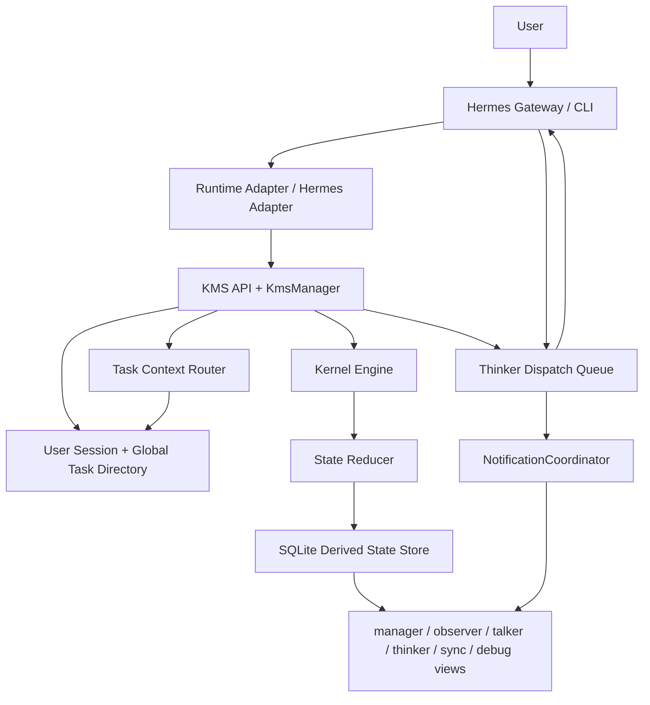

# 当前 Agent 架构说明

日期：2026-06-22

## 1. 总体定位

当前项目不是要替代 Hermes，也不是要重新实现完整 Agent Runtime。

当前架构定位是：

```text
Hermes / Host Runtime
  负责：消息历史、模型执行、工具调用、流式输出、runtime session

KMS
  负责：用户消息调度、任务路由、是否打断、是否直接回答、通知和 dispatch

Kernel
  负责：认知状态、任务状态、事件归约、可见性视图、审计
```

一句话：

```text
Hermes 负责“跑任务”，KMS 负责“调度任务”，Kernel 负责“保存和解释任务状态”。
```

## 2. 当前分层



## 3. 核心模块

| 模块 | 当前职责 |
|---|---|
| Hermes Gateway / CLI | 接收用户消息，执行真实模型和工具 |
| HermesAdapter | Hermes 侧调用 Kernel/KMS 的 HTTP client |
| RuntimeEventAdapter | 通用 runtime adapter，已完成第一版 |
| KMS API | 对外提供 dispatch、thinker lifecycle、notification、view API |
| KmsManager | 用户消息调度主入口，目前仍偏大 |
| TaskRoutingCoordinator | 管理 user session、读取 global tasks、调用 router |
| Task Context Router | 判断用户消息属于哪个 task，或是否需要澄清 |
| DispatchLifecycleCoordinator | 创建 run、激活 run、创建 thinker dispatch |
| InterruptCoordinator | 处理中断当前任务、暂停 task |
| ResumeCoordinator | 恢复 paused task |
| KernelEngine | 连接 store 和 reducer，生成 views |
| State Reducer | 从事件流计算当前状态 |
| NotificationCoordinator | 根据 dispatch complete / fail 生成 observer notification |
| ConversationRefCoordinator | 统一写 task conversation refs |

## 4. 当前数据模型

| 表 / 状态 | 用途 |
|---|---|
| `user_sessions` | 用户会话，一个 user session 可以挂多个 task |
| `global_tasks` | 全局任务目录，用于多任务路由 |
| `task_context_routes` | 每次用户消息的路由审计 |
| `session_links` | kernel session 和 runtime session 的映射 |
| `task_snapshots` | task 当前快照 |
| `intent_states` | 旧架构意图状态，目前仍是事实来源之一 |
| `plan_states` | 旧架构计划状态，目前仍是事实来源之一 |
| `belief_items` | 旧架构 belief 状态，目前仍保留 |
| `commitments` | 旧架构 commitment 状态，目前仍保留 |
| `task_brief_states` | 新命名兼容层 |
| `task_flows` | 新命名兼容层 |
| `claim_items` | 新命名兼容层 |
| `todo_obligations` | 新命名兼容层 |
| `thinker_dispatches` | KMS 下发给 Thinker 的任务单 |
| `observer_notifications` | 通知 Observer / Talker 主动刷新或汇报 |
| `task_conversation_refs` | task 级消息摘要和 runtime message 引用，不保存完整 transcript |
| `runtime_refs` | runtime 消息、工具、结果引用索引 |

## 5. 用户消息主流程

```text
1. Hermes 收到用户消息
2. Hermes 调用 /kms/dispatch-user-message
3. KMS observe user_session
4. Task Router 根据 global_tasks + conversation refs 判断目标 task
5. Intent Classifier 判断：
   - 直接由 Kernel 回答
   - 继续当前 task
   - 打断当前 task，创建新 run
   - 恢复 paused task
   - 需要用户澄清
6. 如果需要 Thinker：
   - KMS 创建 run
   - 更新 task/global_task
   - 创建 thinker_dispatch
7. Hermes claim thinker_dispatch
8. Thinker 执行任务并提交事件
9. Thinker complete / fail dispatch
10. KMS 更新 run 状态，生成 notification 和 conversation ref
11. Observer/Talker 读取 observer_view / talker_view
```

## 6. 打断机制

当前打断机制是：

```text
新用户消息进入同一 user session
-> KMS 判断是否会影响当前 active task
-> 如果需要执行新任务，暂停旧 task
-> 标记旧 run stale / interrupted
-> 创建新 run 和 thinker_dispatch
-> Thinker 只能继续写 active run
```

关键点：

- 旧 run 的 stale 写入不会污染当前用户可见状态。
- 旧 task 会进入 paused，可后续恢复。
- `resume_context` 用于恢复暂停任务。
- 当前默认行为仍接近 Codex：新请求优先打断当前执行。

## 7. 多任务模型

当前已经支持：

```text
一个 user_session
  -> 多个 global_task
  -> 每个 task 有 task_id
  -> 每个 task 可以关联 kernel_session / task snapshot / conversation refs
```

但当前还不是彻底的 task-first 存储：

- 旧 `intent/plan/belief/commitment` 仍主要按 `kernel_session_id` 存。
- 新 `task_brief/task_flow/claim/todo` 是兼容层和影子层。
- `task_conversation_refs` 已经开始按 task 保存消息摘要和 runtime 引用。

## 8. Conversation Refs 边界

设计文档明确要求 Kernel 不重复实现 message history。

所以当前 `task_conversation_refs` 保存的是：

```text
message_ref_id
text_summary
role
source
task_id
run_id
metadata
```

不保存：

```text
完整聊天 transcript
完整 reasoning
完整工具结果
runtime 私有日志
```

完整消息历史仍属于 Hermes / Host Runtime。

## 9. Views

| View | 使用者 | 当前内容 |
|---|---|---|
| `manager_view` | 管理界面 / 用户管理视角 | task brief、task flow、active task、风险、通知、dispatch、conversation refs |
| `observer_view` | Observer / Talker / 外部 UI | 可转述摘要、安全事实、未确认点、待办、阻塞原因、允许/禁止动作、conversation refs |
| `talker_view` | Chat Talker | 面向聊天表达的安全进度 |
| `thinker_view` | Thinker | task brief、plan/task flow、claims、evidence、executions、dispatch、cancellation token |
| `sync_view` | 外部协作系统 | 最小同步摘要 |
| `debug_view` | 开发和审计 | 事件、派生状态、内部详情 |

## 10. Notification

当前已有：

```text
observer_notifications
NotificationCoordinator
GET /kms/observer/notifications
GET /kms/talker/notifications
ack / resolve
```

当前 NotificationCoordinator 已负责：

- dispatch completed -> `task_done` 或 `progress_update`
- dispatch failed -> `task_failed`
- stale dispatch 不生成 notification

当前已完成第一版：

- notification 去重
- min interval 节流
- delivery policy
- SSE 轻量 stream

还未完成：

- 独立后台 push broker
- WebSocket
- 更复杂的 urgency 升级策略

## 11. 当前已稳定验证的能力

这些能力已经完成并通过测试：

| 能力 | 状态 |
|---|---|
| 用户消息 dispatch | 已完成 |
| 打断当前 run | 已完成 |
| stale run 防污染 | 已完成 |
| paused task 恢复 | 已完成 |
| user session + global task directory | 已完成 |
| Task Router | 已完成第一版 |
| LLM Router | 已接入，可开关 |
| thinker_dispatch claim / heartbeat / complete / fail | 已完成 |
| Hermes Gateway/CLI dispatch 生命周期 | 已完成第一版 |
| proxy mode dispatch 生命周期 | 已完成第一版 |
| manager_view / observer_view | 已完成第一版 |
| observer/talker notification API | 已完成第一版 |
| NotificationCoordinator | 已完成第一版 |
| task conversation refs | 已完成第一版 |

## 12. 当前工作区正在进行的改动

当前工作区有未提交改动，内容是正在继续补：

| 进行中内容 | 状态 |
|---|---|
| 外部 Observer/Talker 最终回复 conversation ref 回传 | 正在实现 |
| ConversationRefCoordinator | 正在实现 |
| RuntimeEventAdapter 通用封装 | 正在实现 |

这些尚未完成全量测试和提交，不能算稳定状态。

## 13. 仍未完成的主要差距

| 差距 | 说明 |
|---|---|
| KmsManager 仍偏大 | 调度分支还集中在一个方法里 |
| Runtime Event Adapter 深度接入 Hermes | 通用 Adapter 已有，真实 Hermes 侧还可继续接入更多 runtime refs |
| Observer notification WebSocket | SSE 第一版已完成，WebSocket 未做 |
| Notification 高级优先级策略 | 第一版去重/节流已完成，复杂升级策略未做 |
| Observer/Talker 最终回复回传 | conversation ref API 已完成第一版 |
| 状态表主从切换 | 旧表仍是事实来源，不建议马上硬切 |

## 14. 不建议立刻做的事

暂时不建议：

- 删除旧 `intent/plan/belief/commitment` 表；
- 把完整 message history 存进 Kernel；
- 让 Kernel 接管 Hermes 的 runtime session DB；
- 让 Observer 绕过 `observer_view` 直接读 debug/raw state；
- 为了新命名强行大迁移旧数据。

当前更稳的方向是：

```text
继续渐进式换骨：
先补 task-local refs / views / coordinator
再拆 KmsManager
再完善通知推送
最后再考虑状态事实来源迁移
```
